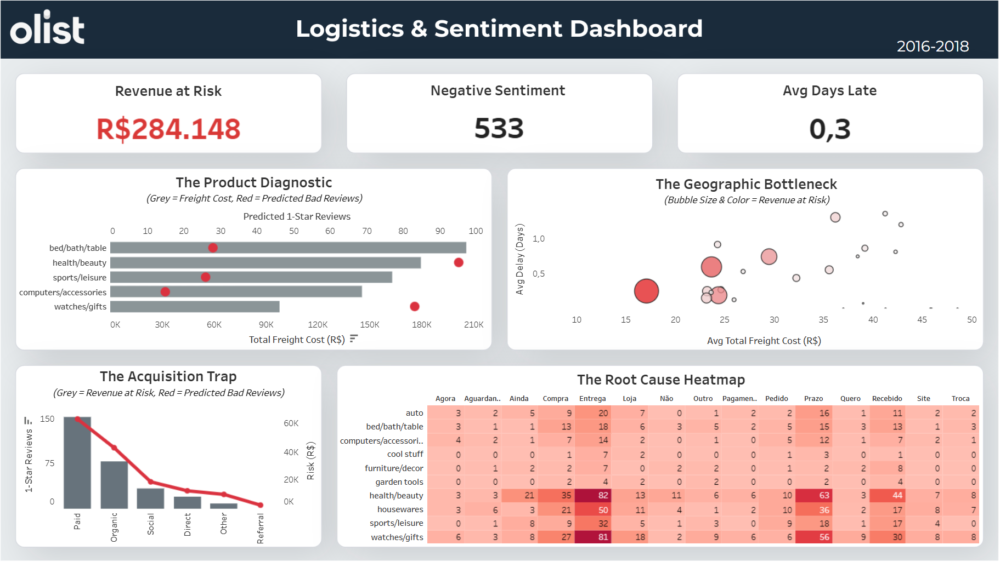

# Olist E-Commerce: Logistics & Sentiment Diagnostic

      

<details>
  <summary>📋 <b>Table of Contents</b> (Click to Expand)</summary>
  
  1. [Overview](#1-overview)
  2. [Business Questions Answered](#2-business-questions-answered)
  3. [The Data Pipeline & Architecture](#3-the-data-pipeline--architecture)
  4. [Key Findings](#4-key-findings)
  5. [Strategic Recommendations](#5-strategic-recommendations)
  6. [Repository Structure](#6-repository-structure)
</details>

---

### 1. Overview
This project analyzes **100k+** orders (2016-2018) from the Olist public datasets. The objective is to identify operational bottlenecks and calculate "Revenue at Risk" by linking logistical delays directly to NLP-predicted negative customer sentiment. 



* 📊 **[View Interactive Dashboard on Tableau Public](https://public.tableau.com/views/Dashboard_17777151953150/FinalDashboard?:language=en-US&publish=yes&:sid=&:display_count=n&:origin=viz_share_link)**
* 💾 **[Olist Brazilian E-Commerce Dataset (Kaggle)](https://www.kaggle.com/datasets/olistbr/brazilian-ecommerce)**
* 💾 **[Olist Marketing Funnel Dataset (Kaggle)](https://www.kaggle.com/datasets/olistbr/marketing-funnel-olist)**

---

### 2. Business Questions Answered
* Which marketing channels are paying to acquire customers who ultimately churn due to logistical failures?
* Which geographic regions are causing the most revenue bleed via late deliveries?
* Which product categories have the highest freight costs versus the highest risk of negative reviews?
* What specific operational complaints are buried within 1-star customer text reviews?

---

### 3. The Data Pipeline & Architecture
* Data Modeling (SQL): Engineered a *PostgreSQL* database (`create_table.sql`) mapping the e-commerce and marketing funnel schemas. Executed joins (`combine_data.sql`) to output consolidated operational views (`vw_seller_order_performance.csv` and `final_operations_context.csv`).
* Predictive Modeling (*Python*/NLP): Tested *Random Forest*, *XGBoost*, and *LightGBM* models to classify qualitative review text. Selected *LightGBM* for its superior recall in detecting bad reviews. This NLP pipeline is critical: it translates raw, qualitative customer text into quantifiable operational root causes.
* Visualization (*Tableau*): Built an executive dashboard (`Dashboard.twbx`) utilizing dual-axis charts and strict figure-ground color hierarchy (grey for baseline context, red for at-risk revenue).

<details>
<summary>💡 <b>View Code Snippet: NLP Text Processing Pipeline</b></summary>

```python
# Extracting logistical failure signals from raw Portuguese text
from sklearn.feature_extraction.text import TfidfVectorizer
from lightgbm import LGBMClassifier

# Vectorize customer reviews focusing on operational root causes
tfidf = TfidfVectorizer(max_features=1000, ngram_range=(1,2))
X_features = tfidf.fit_transform(reviews['review_message_pt'])

# LightGBM chosen for its superior recall in detecting 1-star logistical failures
model = LGBMClassifier(class_weight='balanced', random_state=42)
model.fit(X_features, y_target)
```
</details>

---

### 4. Key Findings

> **TL;DR:** **R$284,148** of revenue is at direct risk due to **533** negative reviews, primarily driven by late deliveries in SP/RJ and inefficient 'Paid Search' marketing spend.

* Revenue at Risk: **R$284,148** total risk driven by **533** NLP-predicted negative reviews, with an average delay of **0.3 days**.
* Product Diagnostic: 'Bed, Bath, Table' carries the highest freight costs (>**R$200K**). However, 'Health & Beauty' is the most critical failure point, driving the highest volume of predicted 1-star reviews (~**95**).
* Geographic Bottlenecks:
  * Sao Paulo (**SP**): **0.254 days** late average | **R$77,435** at risk.
  * Rio de Janeiro (**RJ**): **0.599 days** late average | **R$54,234** at risk.
  * Rio Grande do Sul (**RS**): **0.193 days** late average | **R$38,123** at risk.
  * Bahia (**BA**): **0.747 days** late average | **R$32,569** at risk.
* The Acquisition Trap: 'Paid Search' is the most inefficient acquisition channel, driving **150** predicted bad reviews and jeopardizing over **R$60,000** in revenue.
* Root Cause NLP: The text classification isolates "Entrega" (Delivery), "Prazo" (Deadline), and "Recebido" (Received) as the primary drivers of negative sentiment, specifically clustered within Health/Beauty and Watches/Gifts.

---

### 5. Strategic Recommendations
* Geographic Ad Spend Freeze: Temporarily pause 'Paid Search' acquisition campaigns in high-risk zones (**SP** and **RJ**). We are currently paying premium acquisition costs to drive customers into a failing logistical network, risking **R$60K+**.
* SLA Renegotiation in **SP** & **RJ**: Immediately audit the last-mile delivery partners in Sao Paulo and Rio de Janeiro. These regions account for over **R$131,000** in revenue at risk; if SLAs cannot be met, alternative 3PL partners must be sourced.
* Fulfillment Audit for Health & Beauty: Investigate the specific fulfillment pipeline for Health & Beauty products. Implement dynamic checkout messaging to set realistic shipping expectations for these items to mitigate the disproportionate volume of 1-star reviews.

---

### 6. Repository Structure
```text
├── Dataset/                             # Raw schemas and processed CSV/Excel outputs
├── Assets/                              # Images (Dashboard preview, schemas)
├── data_overview.ipynb                  # Step 1: Initial Pandas EDA
├── create_table.sql                     # Step 2: PostgreSQL schema generation
├── combine_data.sql                     # Step 3: SQL Data joining & view creation
├── sentiment_classification.ipynb       # Step 4: NLP & Machine Learning (LightGBM)
└── Dashboard.twbx                       # Step 5: Final Tableau Dashboard
```

---

> **Business Glossary**
> * **SLA (Service Level Agreement):** The promised delivery deadline to the customer. When an SLA is breached, the package is late.
> * **3PL (Third-Party Logistics):** External delivery companies and couriers (e.g., Correios, JNE) hired to fulfill orders.
